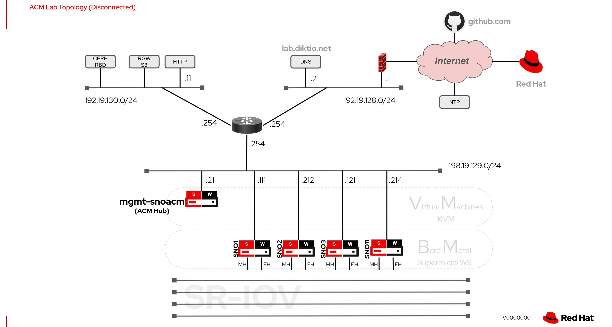
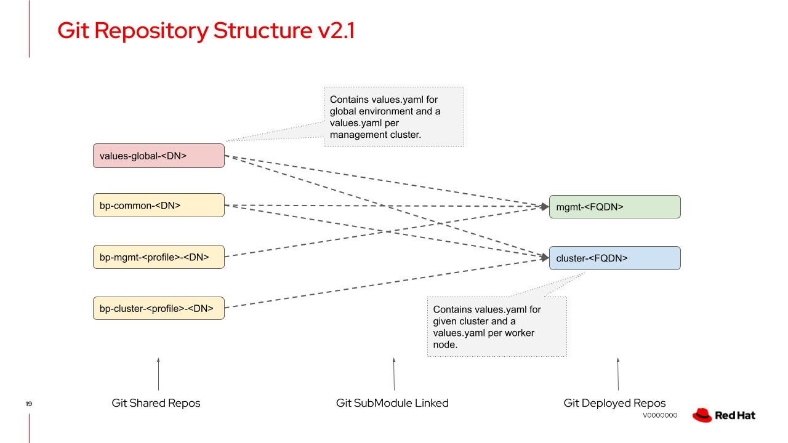
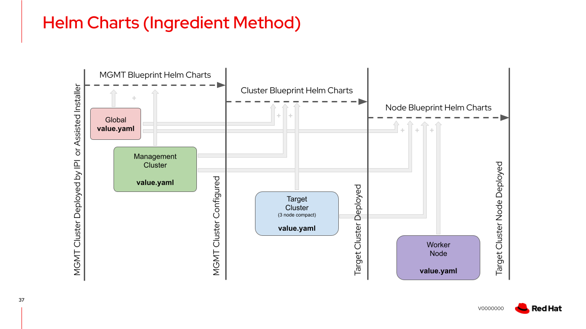

```bash
#############################################################################
DISCLAIMER: THESE ARE UNSUPPORTED COMMUNITY TOOLS.

THE REFERENCES ARE PROVIDED "AS IS", WITHOUT WARRANTY OF ANY KIND, EXPRESS OR
IMPLIED, INCLUDING BUT NOT LIMITED TO THE WARRANTIES OF MERCHANTABILITY,
FITNESS FOR A PARTICULAR PURPOSE AND NONINFRINGEMENT.
#############################################################################
```
# **DRAFT** work in progress

# Description
This lab illustrates how to set-up scalable GitOps structures utilising Helm chart templating with OpenShift-GitOps (ArgoCD) to deploy OpenShift bare-metal clusters through OpenShift ACM.

# Lab2
This lab configures a pre-deployed (day-0) compact 3-node cluster as an ACM management hub cluster that deploys clusters using ACM ZTP-Workflow and/or ACm Assisted-Installer GitOps. The environment is connected to the Internet for the Management cluster but the deployed target clusters are disconnected and therefore mirroring is required.

The topology of  the lab is as illustrated below:

---
<p align="center">
  
</p>

---


- SNO Management cluster:
    - 1 x VM with:
        - 40 x vCPU
        - 80GB RAM
        - 128GB OS disk
        - 756GB Data disk **NOTE** This data disk/qcow2 must be on a separate physical disk than the OS qcow2 else etcd latencies will blow out, even on NVMe.
    - Deployed by Assisted-Installer SaaS (https://console.redhat.com/openshift/)
    - OCP 4.10.20 tested
- SNO Clusters (SNO1, SNO2 and SNO3):
    - 3 x Supermicro X12 Workstation Motherboard
        - Intel i9 - 10 core
        - 64GB RAM
        - 1TB NVMe for OS
        - 500GB SSD for ODF-LVM
        - 2 x 10GE Intel-x710
- SNO Cluster (SNO11):
    - 1 x Supermicro X11 Workstation Motherboard
        - Intel i9 - 8 core
        - 64GB RAM
        - 1TB NVMe for OS
        - 500GB SSD for ODF-LVM
        - 2 x 10GE Intel-x710
- HTTP server (optional) to hold some iso images
- DNS server for resolution of lab domain and nodes and VIPs:
    - Management cluster entries:
        - master1.snoacm.lab.diktio.net
        - api.snoacm.lab.diktio.net
        - *.apps.snoacm.lab.diktio.net
    - Compact cluster entries:
        - master1.smcdu1.lab.diktio.net
            - api.smcdu1.lab.diktio.net
            - *.apps.smcdu1.lab.diktio.net
        - master1.smcdu2.lab.diktio.net
            - api.smcdu2.lab.diktio.net
            - *.apps.smcdu2.lab.diktio.net
        - master1.smcdu3.lab.diktio.net
            - api.smcdu3.lab.diktio.net
            - *.apps.smcdu3.lab.diktio.net
        - master1.smcdu11.lab.diktio.net
            - api.smcdu11.lab.diktio.net
            - *.apps.smcdu11.lab.diktio.net

## Github account requirements
The GitOps scripts for this lab expect HTTP token authentication to a personal account on github.com as this is a simple lab set-up.

For more secure deployments you may consider using a git org where you can set up read-only bot accounts for accessing the repositories.

The provided GitOps github.com scripts may require some modifications if using another git online service or private git deployment.

# Customising the Management cluster configuration
## Step 0: Deploy the Management base cluster
This lab uses a VM primarily for the reason that the physical hardware at hand did not have enough CPU resources to support all the required operators. The VM is on a physical machine that has a 10 core i9 (20 vCPU) so this hypervisor is effectively 200% oversubscribed as the VM is given 40 CPU. A physical machine with a 16+ core CPU (32+ vCPU) or less vCPU for the VM may likely work but it has not been tested.

Whether a VM or BM is used for the Management cluster, it **must** be installed by IPI BM or Assisted-Installer as the bare-metal host operator is required.

The configuration deployed by this lab release assumes SNO and therefore deploys ODF-LVM (tech-preview) for central storage. For a multi-node management cluster ODF will be required and will be part of future releases.

The installation of the day-0 management  base cluster is beyond the scope of this set of instructions as it is believed to be well known to users and documented in OCP documentation. 

## Step 1: Edit Global values (/global/values.yaml)
Either create your own new repository or fork the supplied repository so you can customise the global/values.yaml file for your lab environment.

Parameters you must customise (at minimum):
- global.domain - Your domain.
- global.git_user - Your Git service account name.
- global.git_token - Your HTTP access token to your Git account.
- global.dns - A local DNS server where you created the entires listed above. This will make life easier than trying to juggle things with /etc/hosts files. The actual build for this lab does require DNS entries (a DNS server address is though) as we'll be statically naming nodes.
- global.git_cluster_prefix_url - The URL prefix to your Git service account.
- global.mirror.list [1st entry] - Add/Change the desired OCP v4.10 **mirror** release you'd like. Note that anything less than v4.10.13 has not been tested.
- global.registry.* - Set an environment wide local registry for the mirrored images. This may be overridden by a management/regional cluster values.yaml
  - url - URL for the registry (e.g. "lab-registry.ocpmgmt.lab.diktio.net")
  - path - Path/Repository-name used for the given OCP release (e.g. "ocp41020")
  - user: - User name to authenticate to mirror repository
  - password: Password to authenticate to mirror repository
- global.mirror.list.install_mirror_name - Match the global.mirror.list.name you desire to install.
- global.quay.config_yaml
  - SERVER_HOSTNAME - FQDN of local registry mirror
- global.quay.ssl_cert - Certificate for SERVER_HOSTNAME FQDN
- global.quay.ssl_key - Certificate Key for SERVER_HOSTNAME FQDN
- global.ai.ssh_key - SSH public key to allow access to nodes.
- global.ai.pull_secret_name - Please do NOT change for ACM 2.4.X
- global.ai.ca - Local CA certificate (that signed Quay cert)


## Step 2: Edit Management Cluster values (/<MGMT_FQDN>/values.yaml)

Parameters you must customise:
- mgmt.name - Name of the cluster.
- mgmt.git_url - The URL to your management cluster repository.
- mgmt.values_location - Replace the FQDN to  your management clusters FQDN (/values/<MGMT_FQDN>/values.yaml).
- mgmt.nodes.masters[name] - The FQDN of your SNO node.

  **QUAY global override, else set to empty string ("") for each file**
- mgmt.quay.config_yaml
  - SERVER_HOSTNAME - FQDN of local registry mirror
- mgmt.quay.ssl_cert - Certificate for SERVER_HOSTNAME FQDN
- mgmt.quay.ssl_key - Certificate Key for SERVER_HOSTNAME FQDN

- mgmt.os_images.root_fs_img_url - IP address of local HTTP server else uncomment Internet URL line.
- mgmt.os_images.root_fs_iso_url - IP address of local HTTP server else uncomment Internet URL line.
- mgmt.bmh.root_fs_img_url - IP address of local HTTP server else uncomment Internet URL line.

## Step 3: Create Management Cluster Repository (snoacm.lab.diktio.net)

Start with a blank repository:
```bash
cd <repository_path>
mkdir -p clusters

cp -r ../mgmt-snoacm.lab.diktio.net/deploy.sh \
  ../mgmt-snoacm.lab.diktio.net/gitops-push-operator-mirror .

```
Now link the blueprints:

- **Blueprint for SNO Management Hub cluster**
```bash
git submodule add https://github.com/openshift-telco/bp-mgmt-sno.lab.diktio.net.git bp-mgmt
```

- **Mapping to environment wide common configurations and worker node blueprints**
```bash
git submodule add https://github.com/openshift-telco/bp-common.lab.diktio.net.git bp-common
```
- **Mapping environment and region wide Helm values.yaml files**
```bash
git submodule add <URL_to_your_values_repo> values
```
## Step 4: Configure the Management cluster via GitOps
At this point the values repository should be updated and committed **and** all submodules updated for the management cluster.

Update the repositories:
```bash
cd <repository_path>/bp-mgmt
git pull

cd ../bp-common
git pull

cd ../values
git pull

cd ../
git commit -a -m "blueprint sync"
git push
```

## Step 5: Kick off the Management cluster configuration
To kick off the deployment, you will need to have the Helm 3 CLI tool installed on your machine. This can be downloaded form https://console.redhat.com/openshift/downloads under the "Developer tools" section. 

Now kick off deployment with the deploy.sh script that runs 2 helm install commands to install the Openshift-gitops operator and configure it with a minimal config to start the pull from the repository and start configuring itself.

```bash
cd <repository_path>
bash deploy.sh <FQDN_management_cluster>
```
# Customising the target cluster deployment
## Step 1: Create Target Cluster Repository (cluster-smcdu2.lab.diktio.net)

Start with a blank repository:
```bash
cd <repository_path>

cp -r ../cluster-smcdu2.lab.diktio.net/values.yaml .
```
### Now link the blueprints:

- **Blueprint for SNO Target cluster**
```bash
git submodule add https://github.com/openshift-telco/bp-cluster-sno-du12.lab.diktio.net.git bp-cluster
```

- **Mapping to environment wide common configurations and worker node blueprints**
```bash
git submodule add https://github.com/openshift-telco/bp-common.lab.diktio.net.git bp-common
```
- **Mapping environment and region wide Helm values.yaml files**
```bash
git submodule add <URL_to_your_values_repo> values
```
## Step 2: Customise the values.yaml for the target cluster

### Parameters you must customise:
- cluster.name - Cluster name.
**VIP IPs not necessary for SNO and  not used by this blueprint**
- cluster.api_vip - API VIP. - IGNORE
- cluster.ingress_vip - Ingres VIP. - IGNORE
- cluster.default_router - Local default-router. 
- cluster.install_mirror_name - OCP version to install. Must match the global.mirror.list.name you want.
- cluster.nodes.masters[boot_dev_hint] (each node) - The desired disk to install RHCOS
- cluster.nodes.masters[IP] (each node) - The static IP address of the given node.
- cluster.nodes.masters.interfaces[LIST] (each node) - List all interfaces on each node making sure the primary cluster-network interface is 1st in the list.
- cluster.nodes.masters[bmc_username] (each node) - Username for BMC access.
- cluster.nodes.masters[bmc_password] (each node) - Passowrd for BMC access.
- cluster.nodes.masters[bmc_address] (each node) - URL for nodes Redfish access.

## Step 3: Deploy the target cluster via GitOps
At this point the values repository should be updated and committed **and** all submodules updated for the target cluster.

Update the repositories:
```bash
cd <target_repository_path>/bp-cluster
git pull

cd ../bp-common
git pull

cd ../values
git pull

cd ../
git commit -a -m "blueprint sync"
git push
```
Kick of the deployment:
```bash
cd <management_repository_path>
mkdir -p clusters/<FQDN_Target_CLuster>
touch clusters/<FQDN_Target_CLuster>/deploy

git commit -a -m "Deploy Target CLuster"
git push
```

# Git Submodule Concept

---
<p align="center">
  
</p>

---
# Helm Values Build

---
<p align="center">
  
</p>

---
# Repository Links
## Global and Regional values.yaml files:
https://github.com/openshift-telco/values-global-lab.diktio.net

## Environment wide configurations and Node profiles:
https://github.com/openshift-telco/bp-common.lab.diktio.net

## Blueprint for Management (Hub) cluster configuration profile type SNO:
https://github.com/openshift-telco/bp-mgmt-sno.lab.diktio.net

## Blueprint for target cluster profile type compact (DU SNO SuperMicro X12 WS):
https://github.com/openshift-telco/bp-cluster-sno-du12.lab.diktio.net

## Management cluster repository:
https://github.com/openshift-telco/mgmt-snoacm.lab.diktio.net

## Target compact cluster repository:
https://github.com/openshift-telco/cluster-smcdu2.lab.diktio.net
