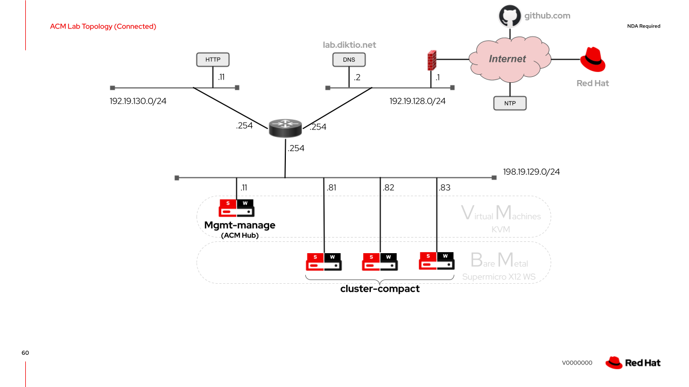

```bash
#############################################################################
DISCLAIMER: THESE ARE UNSUPPORTED COMMUNITY TOOLS.

THE REFERENCES ARE PROVIDED "AS IS", WITHOUT WARRANTY OF ANY KIND, EXPRESS OR
IMPLIED, INCLUDING BUT NOT LIMITED TO THE WARRANTIES OF MERCHANTABILITY,
FITNESS FOR A PARTICULAR PURPOSE AND NONINFRINGEMENT.
#############################################################################
```
# **DRAFT** work in progress

# Description
This illustrates how to set-up scalable GitOps structures utilising Helm chart templating with OpenShift-GitOps (ArgoCD) to deploy OpenShift bare-metal clusters through OpenSHift ACM.

# Lab1
This lab configures a pre-deployed (day-0) cluster as an ACM management hub cluster that deploys a 3-node compact cluster using GitOps and ACM. The environment is connected to the Internet and therefore mirroring is required. Note that the GitOps scripts are contain unused structures intended for a disconnected environment that will be utilised in Lab2.

The topology of  the lab is as illustrated below:

---
<p align="center">
  
</p>

---

- SNO Management cluster:
    - VM - 40 x vCPU, 64GB RAM
    - Deployed by Assisted-Installer SaaS (https://console.redhat.com/openshift/)
    - OCP 4.10.11
- Compact cluster:
    - 3 x Supermicro X12 Workstation Motherboard
        - Intel i9 - 10 core
        - 64GB RAM
        - 1TB NVMe for OS
        - 500GB SSD for ODF
        - 2 x 10GE Intel-x710
- HTTP server (optional) to hold some iso images to save downloading down 80Mbps Internet link ;-)
- DNS server for resolution of lab domain and nodes and VIPs:
    - Management cluster entries:
        - master1.manage.lab.diktio.net
        - api.manage.lab.diktio.net
        - *.apps.manage.lab.diktio.net
    - Compact cluster entries:
        - master1.compact.lab.diktio.net
        - master2.compact.lab.diktio.net
        - master3.compact.lab.diktio.net
        - api.compact.lab.diktio.net
        - *.apps.compact.lab.diktio.net

## Github account requirements
The GitOps scripts for this lab expect HTTP token authentication to a personal account on github.com as this is a simple lab set-up.

For production deployments it is recommended to consider using a git org where you can set up read-only bot accounts for accessing the repositories.

The provided GitOps scripts may require some modifications if using another git online service or private git deployment.

# Customising the deployment
## Step 1: Edit Global values (/global/values.yaml)
Either create your own new repository or fork the supplied repository so you can customise the global/values.yaml file for your lab environment.

Parameters you must customise:
- global.domain - Your domain.
- global.git_user - Your Git service account name.
- global.git_token - Your HTTP access token to your Git account.
- global.dns - A local DNS server where you created the entires listed above. This will make life easier than trying to juggle things with /etc/hosts files. The actual build for this lab does require DNS entries (a DNS server address is though) as we'll be statically naming nodes.
- global.git_cluster_prefix_url - The URL prefix to your Git service account.
- global.mirror.list [1st entry] - Change to the desired OCP v4.10 release you'd like. Note that anything less than v4.10.9 has not been tested.
- global.mirror.list.install_mirror_name - Match the global.mirror.list.name you desire to install.
- global.ai.ssh_key - SSH public key to allow access to nodes.
- global.ai.pull_secret_name - Please fot NOT change for ACM 2.4.X

## Step 2: Edit Management CLuster values (/<MGMT_FQDN>/values.yaml)

Parameters you must customise:
- mgmt.name - Name of the cluster.
- mgmt.git_url - The URL to your management cluster repository.
- mgmt.values_location - Replace the FQDN to  your management clusters FQDN (/values/<MGMT_FQDN>/values.yaml).
- mgmt.nodes.masters[name] - The GQDN of your SNO node.

# Management Cluster : manage.lab.diktio.net

ODF-LVM
SNO

## Creating repository

### Blueprint for SNO Management Hub cluster (connected environment)
git submodule add https://github.com/openshift-telco/bp-mgmt-sno-acm.lab.diktio.net.git bp-mgmt
### Mapping environment and region wide Helm values.yaml files
git submodule add https://github.com/openshift-telco/values-global-lab.diktio.net.git values
### Mapping to environment wide common configurations and worker node blueprints
git submodule add https://github.com/openshift-telco/bp-common.lab.diktio.net.git bp-common
